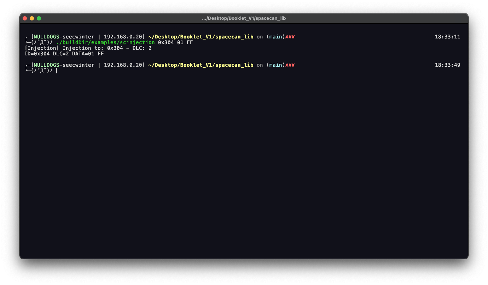
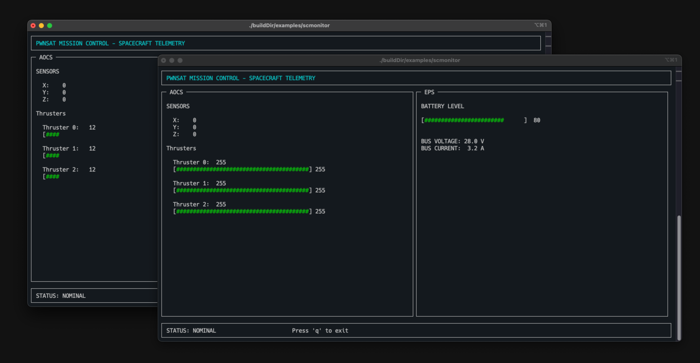
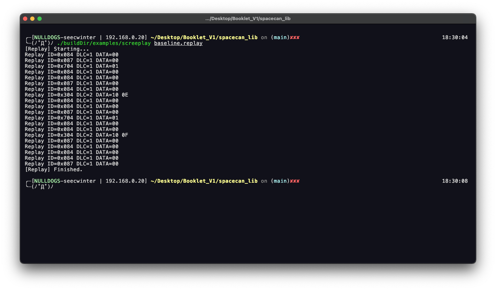

# Spacecanbus interface audtoring

## Scenario

El cliente solicita validar si la comunicacion de SpaceCANbus esta correctamente realizada.

## Frame
- **Access:** White box
- **Environment:** Dinamic

## Execution

**Exploit Case 14: SpaceCAN Reply Spoofing**

**Target:** Reply family `0x300 + node_id`.

**Purpose:** Demonstrate telemetry trust abuse by forging responder-originated data.

**Mechanism:**

Inject a reply-like frame:

```shell
./buildDir/examples/scinjection 0x304 01 FF
```

This frame claims to be a reply from node `0x04`. The example payload uses `01` as a DLC followed by arbitrary values. The exact field meaning is application-specific; the attack pattern is not.



**Expected Observations:**

- The monitoring path records a reply from the forged node ID.
- Any display that trusts reply CAN IDs may attribute the payload to node `0x04`.
- If replayed repeatedly, forged telemetry can obscure real state.



**Impact:**

Forged replies can mislead operators, mask subsystem failure, or poison higher-level decision logic. In a real spacecraft, this class of weakness is especially dangerous when autonomous fault management trusts housekeeping values without provenance.

**Exploit Case 15: SpaceCAN Replay**

**Target:** Captured `baseline.replay` traffic.

**Purpose:** Test whether bus state transitions depend on freshness or merely on frame content.

**Mechanism:**

Capture a replay file with `scsniffer -r`, then replay it:

```shell
./buildDir/examples/screplay baseline.replay
```



The replay tool preserves inter-frame timing from the captured records. That makes it useful for reproducing operational cadence, not just byte values.

**Expected Observations:**

- Previously captured frames are resent with original timing gaps.
- Nodes or monitors react as if the traffic occurred again.
- No sequence counter, nonce, timestamp authentication, or freshness window blocks the replay in the local library.


**Impact:**

Replay demonstrates why timing alone is not a security control. A bus that accepts old frames can repeat stale state, stale telemetry, or stale commands.


## Findings
La libreria cuenta con un DOS en el APID 0x06

## SPARTA

- `EX-0014.02 Bus Traffic Spoofing`
- `DE-0002.03 Inhibit Spacecraft Functionality`, if false telemetry hides a fault or drives bad operator action.
- `REC-0005.01 Uplink Intercept Eavesdropping`, for the original capture.
- `EX-0014.02 Bus Traffic Spoofing`, for replay on the bus.