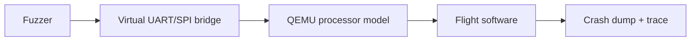

# Example 2: Firmware Assessment with QEMU

## Scenario

A satellite operator provides flight-software source, binaries, build
instructions, command dictionaries, and partial architecture documentation.
Hardware is unavailable. The assessor must emulate the processor and selected
interfaces in QEMU.

## Frame

- **Assessment:** `ASM-2026-002`
- **Primary asset:** `AST-SV-FSW-001` Flight-software command-and-data-handling
  image
- **Related asset:** `AST-SV-IF-001` Telecommand input interface
- **Access:** White box for software; black box for physical hardware
- **Environment:** QEMU with virtual UART and SPI bridges
- **Mission objective `OBJ-001`:** Maintain authorized commandability and
  recoverability.
- **Claim `CLM-004`:** Invalid telecommands cannot interrupt command processing
  or bypass authorization logic.

## Acquire

The auditor selects and documents three method runs:

| Run | Auditor-selected method | Result |
|---|---|---|
| `RUN-BUILD-001` | Reproducible build review | Binary reproduced with documented deviations |
| `RUN-QEMU-001` | QEMU emulation and virtual peripheral bridging | Command path reached in emulator |
| `RUN-FUZZ-001` | Coverage-guided parser fuzzing | Malformed frame reproducibly crashes command task |

Evidence:

- `EVD-010`: build manifest and hashes.
- `EVD-011`: QEMU configuration and bridge scripts.
- `EVD-012`: minimized crashing input.
- `EVD-013`: debugger trace showing out-of-bounds write.
- `EVD-014`: recovery behavior after task restart.

## Relate

### Finding FND-004

Given an actor able to deliver an accepted telecommand frame, a malformed length
can exploit an unchecked copy in the command parser, terminate the command
task, and temporarily interrupt authorized command processing.

Mappings:

| Framework | Mapping | State | Rationale |
|---|---|---|---|
| SPARTA | `EX-0009 Exploit Code Flaws` | Confirmed | Code flaw and execution effect reproduced in the emulated flight image |
| SPARTA | `DE-0002 Disrupt or Deceive Downlink` | Not applicable | The observed behavior affected command processing, not downlink visibility |
| NIST / organization controls | Input validation and software verification requirements | Deficiency | Required negative-input behavior was absent |

Conclusion reasoning:

- The claim Does Not Meet its acceptance criteria in the QEMU environment
  because malformed input reproducibly interrupts command processing.
- Confidence is Medium. The defect and QEMU effect are direct; RF reachability,
  physical timing, watchdog behavior, and on-orbit recovery were not validated.
- Automatic task restart limits the observed effect but does not change the
  demonstrated claim failure.

## Inform

### FARI Result Card

| Field | Result |
|---|---|
| Conclusion | Does Not Meet |
| Confidence | Medium |
| Required Action | Remediate, then Retest |
| Priority | Immediate before representative hardware approval |
| Scope Boundary | Integrated software image in the documented QEMU environment |

Required actions:

1. Enforce frame-length bounds before copy or allocation.
2. Add malformed-frame regression tests and sanitizer-enabled host tests.
3. Validate the patched image on a FlatSat or engineering model.
4. Test whether link-layer authentication and filtering prevent delivery.
5. Define an operational detection and recovery procedure.

### Assurance Statement

> Claim CLM-004 is not supported in the QEMU environment. The malformed-frame
> defect and command-task interruption are confirmed with medium confidence for
> the integrated software image. Physical-interface, RF-delivery, timing, and
> on-orbit conclusions remain unassessed.

### FARI value

The technical team remains free to choose QEMU, bridge design, fuzzing engine,
and debugging approach. FARI converts the work into a bounded conclusion,
SPARTA relationship, remediation plan, and honest assurance claim.
