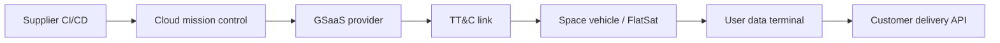
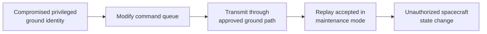

# Example 3: Mission-Wide Multi-Team Assessment

## Scenario

A commercial Earth-observation mission commissions a grey-box assessment before
launch. Different teams assess flight software, a FlatSat, GSaaS integration,
mission-control cloud services, and a user data terminal.

## Frame

Mission objectives:

- `OBJ-001`: Maintain authorized spacecraft commandability.
- `OBJ-002`: Preserve payload-data integrity.
- `OBJ-003`: Recover safely from faults and malicious inputs.
- `OBJ-004`: Prevent unauthorized disclosure of customer imagery.

Scoped architecture:

The FARI assessment owner defines common asset IDs, gating claims, evidence
handling, SPARTA access date, conclusion rules, and consolidated-report
requirements. Each technical team retains its own test procedure and does not
need to use FARI.

## Acquire

| Team | Method Run | Scope | Example Output |
|---|---|---|---|
| Firmware | `RUN-FW-001` | Source and binary review | Unsigned optional plugin accepted by build |
| FlatSat | `RUN-HIL-001` | Hardware-in-the-loop command testing | Replayed maintenance command accepted in a specific mode |
| Ground | `RUN-GND-001` | Cloud/API/identity assessment | Excessive privilege permits command-queue modification |
| GSaaS | `RUN-GSAAS-001` | Configuration and tenant-boundary review | No critical finding; partial evidence only |
| User | `RUN-USER-001` | Terminal firmware and API assessment | Cached payload data stored unencrypted |

## Relate

FARI connects the separate findings into an attack path:

Example cross-framework relationships:

- Ground identity and cloud behavior: MITRE ATT&CK mappings selected by the
  ground team.
- Spacecraft-facing path: SPARTA `IA-0007 Compromise Ground System` as a
  candidate relationship until end-to-end execution is demonstrated.
- Flight-build dependency risk: SPARTA `IA-0001.01 Software Dependencies &
  Development Tools`.
- Mission risk: Unauthorized command execution could violate `OBJ-001` and
  `OBJ-003`.

The connected mission scenario causes the command-path gating claim to Does Not
Meet because a trusted path and a spacecraft-mode weakness combine to reduce
barriers.

## Inform

### Consolidated FARI Result Card

| Field | Result |
|---|---|
| Overall Conclusion | Does Not Meet |
| Confidence | Medium |
| Required Action | Remediate and Retest |
| Priority | Immediate before launch |
| Scope Boundary | Declared pre-launch grey-box scope; on-orbit RF resistance excluded |

### Executive Decisions

1. Remove excessive command-queue privileges before launch.
2. Enforce command freshness and anti-replay checks in all spacecraft modes.
3. Require signed build plugins and record provenance in the flight build.
4. Complete the GSaaS evidence gap before declaring the command path assessed.
5. Encrypt user-terminal payload cache and verify key handling.

### Coverage Statement

| Area | Status | Important limitation |
|---|---|---|
| Flight software | Reviewed and partially tested | No on-orbit environment |
| FlatSat command path | Tested | RF front-end not representative |
| Mission-control cloud | Tested | Supplier-managed identity logs were sampled |
| GSaaS | Reviewed / inferred | Tenant-isolation test evidence incomplete |
| User terminal | Tested | One hardware revision only |

### Assurance Statement

> The pre-launch assessment provides medium-confidence evidence that the
> defined command path contains a credible cross-segment attack scenario.
> Launch readiness for OBJ-001 and OBJ-003 is not supported until the replay
> and privilege findings are remediated and verified. No conclusion is made
> about on-orbit RF resistance.

### FARI value

FARI reveals the mission-level path that no single team owns, preserves each
team's method and evidence, and prevents incomplete GSaaS evidence from being
reported as a clean result.
