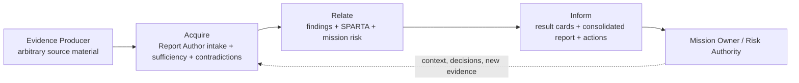

# FARI Process Validation from Pilot Cases

## Purpose

This document records what the first four case reports revealed about the FARI
process and which changes were made before treating the framework as stable.

## Cases Used

| Case | Evidence Type | Report Outcome |
|---|---|---|
| `01_Lib.md` | Raw fuzzing and AddressSanitizer logs with short analyst conclusion | Does Not Meet; confirmed technical claim failure |
| `02_USB.md` | Test concept, script, reproduction plan, expected observations, analyst conclusion | Inconclusive; extended investigation required |
| `03_USB.md` | Source excerpt, malformed USB telecommand screenshot, and impact assertions | Inconclusive; delivery demonstrated but effect unresolved |
| `04_Spacecanbus.md` | Bus injection/replay commands and monitor screenshots | Does Not Meet in lab monitoring scope; broader effects unresolved |

## What Worked

1. **Method agnosticism worked.** FARI accepted raw fuzzing logs and a
   hardware-interface test concept without prescribing either technical method.
2. **SPARTA added useful context.** The reports corrected or refined mappings
   without changing the supplied technical evidence.
3. **Risk, confidence, and coverage remained separate.** Confirmed technical
   defects did not automatically become confirmed mission-level denial of
   service.
4. **Executive decisions were possible with incomplete evidence.** Both reports
   identify safe next actions while remaining provisional.
5. **A portfolio conclusion remained simple as cases increased.** Four
   investigation reports totalize into one result without averaging technical
   findings or inventing a numeric score.

## Problems Revealed

### PV-001: Evidence Producer and Report Author Were Not Explicitly Separate

The original process assumed the assessment team would both execute testing and
write the final report. The intended operating model requires the auditor to
produce evidence and another role to create the FARI report.

**Change made:** Added explicit Evidence Producer, Report Author, Mission Owner,
and Risk Authority roles.

### PV-002: Raw Source Material Can Support Different Strengths of Conclusion

The library case supports a confirmed memory-safety defect, but does not support
confirmed external reachability or mission-level denial of service.

**Change made:** Added separate evidence-sufficiency decisions for technical
condition, reachability, and mission consequence.

### PV-003: Missing Context Must Be Added Without Becoming Fiction

Neither case supplied complete mission objectives, architecture, ownership,
authorization, or consequence definitions. Reports still need enough context to
be useful.

**Change made:** Added evidence dispositions that distinguish:

- Evidence-backed fact.
- Evidence-producer assertion.
- Report-author inference.
- Assumption.
- Missing information.

### PV-004: Contradictions Need First-Class Treatment

The USB case contains APID and payload-format contradictions. Quietly selecting
one value would create an unreliable report.

**Change made:** Added contradiction records and required follow-up evidence.

### PV-005: Finding State and Report Maturity Are Different

A provisional report may contain a confirmed technical finding, while a final
report may still contain accepted risks.

**Change made:** Added Draft, Provisional, Final, and Superseded report-maturity
states.

### PV-006: Supplied SPARTA Mappings Require Validation

Both cases proposed `EX-0005.01 Design Flaws`, but the supplied evidence is more
accurately related to software code flaws and command behavior. Mapping by title
alone would have reduced report quality.

**Change made:** Retained the rule that mappings require rationale and added
mapping corrections to the case reports.

### PV-007: FARI Must Not Create Work for an External Evidence Producer

The initial process still expected a structured evidence package and
method-run information from the evidence producer. An external auditor may have
an independent contract, methodology, and report format and should not need
FARI context.

**Change made:** Source material may now arrive in any format. All FARI
normalization, contextual completion, mapping, conclusion, and reporting duties
belong to the Report Author. The former evidence-package template was replaced
with an internal source-material intake record.

### PV-008: Every Investigation Needs an Executive Conclusion

Finding state, report maturity, risk, confidence, and assurance did not provide
one obvious answer to "how did this investigation end?"

**Change made:** Added the mandatory FARI Result Card with Conclusion,
Confidence, Required Action, Priority, Scope Boundary, and Rationale. The
library case concludes `Does Not Meet`; the USB case concludes `Inconclusive`.

### PV-009: Inconclusive Is a Valid but Actionable Outcome

An investigation may be unable to prove or disprove a claim because of scope,
contradictions, or missing observations.

**Change made:** `Inconclusive` is now a first-class FARI Conclusion and must
create an investigation-extension or retest action.

### PV-010: Multiple Reports Need One Consolidated Assessment

Individual reports do not provide a practical executive view for an
infrastructure-wide assessment.

**Change made:** Multi-investigation assessments now require one consolidated
assessment report. Gating claims determine the overall conclusion without
averaging or creating a numeric security score.

### PV-011: A Generic Auditor Form Is Useful Only When It Remains Optional

The supplied cases use a recurring technical structure: scenario, access,
environment, tooling, execution, finding, and mappings. That structure is useful
for ingestion, but requiring it would contradict the no-external-auditor-burden
principle.

**Change made:** Added an Optional Technical Finding Submission Form using
framework-neutral language. An auditor may use it when convenient, while the
Report Author remains responsible for all FARI-specific work.

### PV-012: A Screenshot Can Prove an Action Without Proving Its Cause or Impact

The new USB screenshot proves that a malformed packet was constructed and sent,
but a timeout alone does not prove memory corruption or persistent denial of
service. The SpaceCAN screenshots show injection, replay, and changed displayed
values, but do not prove physical actuator behavior.

**Change made:** Evidence reviews must state exactly what each artifact proves
and must not use screenshots as automatic proof of causal or mission-level
impact.

### PV-013: One Investigation Can Contain Confirmed and Candidate Findings

The SpaceCAN case supports a demonstrated spoofing/display-trust failure while
the replay-specific receiver effect remains only partially evidenced.

**Change made:** The investigation conclusion is derived from its gating claim,
while each finding keeps its own state and evidence boundary.

### PV-014: Repeated Generic Finding Text Is a Source-Material Quality Signal

Both new cases contain a copied denial-of-service statement that does not match
their evidence. The repetition is not harmless formatting; it can create a
false conclusion if copied into an executive report.

**Change made:** The intake review explicitly identifies copied or unrelated
finding text as a contradiction and excludes it from the conclusion.

### PV-015: SPARTA Mappings Need Technique-Level Precision

The SpaceCAN source material mapped replay to bus spoofing and uplink
eavesdropping. The more precise replay mapping is `EX-0001.02 Bus Traffic
Replay`; uplink interception is not demonstrated by a local replay file.

**Change made:** FARI continues to preserve proposed mappings as source
material, but the Report Author validates, corrects, or rejects them with
rationale.

## Current FARI Reporting Workflow

## Remaining Framework Validation Gaps

The four pilots validate intake, contradictory evidence, confirmed and
inconclusive outcomes, SPARTA correction, and consolidation. They do not yet
validate:

- A `Meets` investigation supported by positive control evidence.
- A remediation retest that supersedes an earlier result.
- Mission-owner confirmation of consequence, acceptance criteria, and residual
  risk.
- Multiple independent evidence producers in one investigation.
- Evidence integrity records, revisions, hashes, and chain of custody.
- A Final report maturity transition.
- A full manual-to-web round trip using the canonical schema.

## Recommended Next Validation

Use FARI next on a case or portfolio that contains:

- Multiple evidence producers or methods.
- At least one implemented control whose effectiveness can be credited.
- Mission-owner confirmation of consequence and residual risk.
- A remediation retest.
- Source-material revisions and integrity metadata.

That pilot will validate the transition from a Provisional report to a Final
FARI report.
